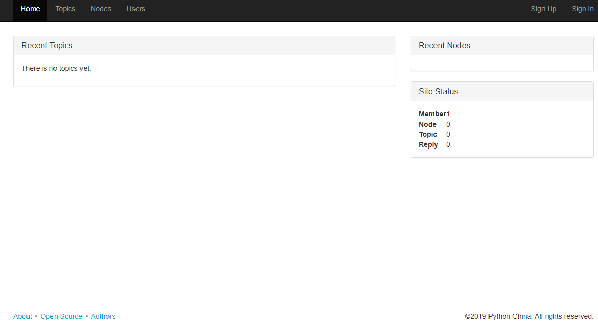

## 准备工作

- 安装NodeJs
- 安装Python27和pip、pipenv等

以下命令皆是在Windows10下的PowerShell执行。

### 使用pipenv创建Python虚拟环境

```PowerShell
pipenv install
pipenv shell
```

注意：

由于`misaka`扩展包的依赖。

需要先到`https://www.microsoft.com/en-us/download/confirmation.aspx?id=44266`下载`Microsoft Visual C++ Compiler for Python 2.7 `，然后把把`install-ext/stdint.h`放到`C:\Users\Administrator\AppData\Local\Programs\Common\Microsoft\Visual C++ for Python\9.0\VC\include`目录下。


### 编译前端代码（可略过）

> 可略过，因为我已经把编译好的前端代码加入了仓库。

由于需要NodeJS编译static assets，所以安装完NodeJS后，还需要执行下面命令安装扩展包。

```PowerShell
npm install -g stylus component uglify-js
cd assets
npm install nib
```

开始编译

```PowerShell
> make static
make[1]: 进入目录“/cygdrive/f/github-hacking/hacking-june/assets”

     install : complete

  compiled index.css

       build : resolved in 40ms
       build : ..\june\public\static\app.js in 347ms - 703kb
(node:16280) [DEP0013] DeprecationWarning: Calling an asynchronous function without callback is deprecated.
       build : ..\june\public\static\app.css in 387ms - 138kb
(node:16280) [DEP0013] DeprecationWarning: Calling an asynchronous function without callback is deprecated.
       build : files in 390ms

make[1]: 离开目录“/cygdrive/f/github-hacking/hacking-june/assets”
```

当`june\public\static`文件夹有文件生成（`apps.js`和`app.css`等），则表示构建成功。

#### 报错的解决方案

如果这一步如果报错会比较难解决，下面是一些报错的解决方案：

报错一：

```PowerShell
fatal : no remote found for dependency "lepture/yue.css@0.4.0". Visit http://component.github.io/troubleshooting for help.
```

由于`lepture/yue.css`已经废弃，所以我在Github上手动下载了一份`yue.css`。

所以只需要把`install-ext\components\lepture\yue.css`文件夹拷贝到`assets\components\lepture`目录下，再执行`make static`即可。

也可以直接把`install-ext\components`整个文件夹直接覆盖`assets\components`。

### 创建数据库并启动

```PowerShell
python manager.py createdb
python manager.py runserver
```

## 主页截图


